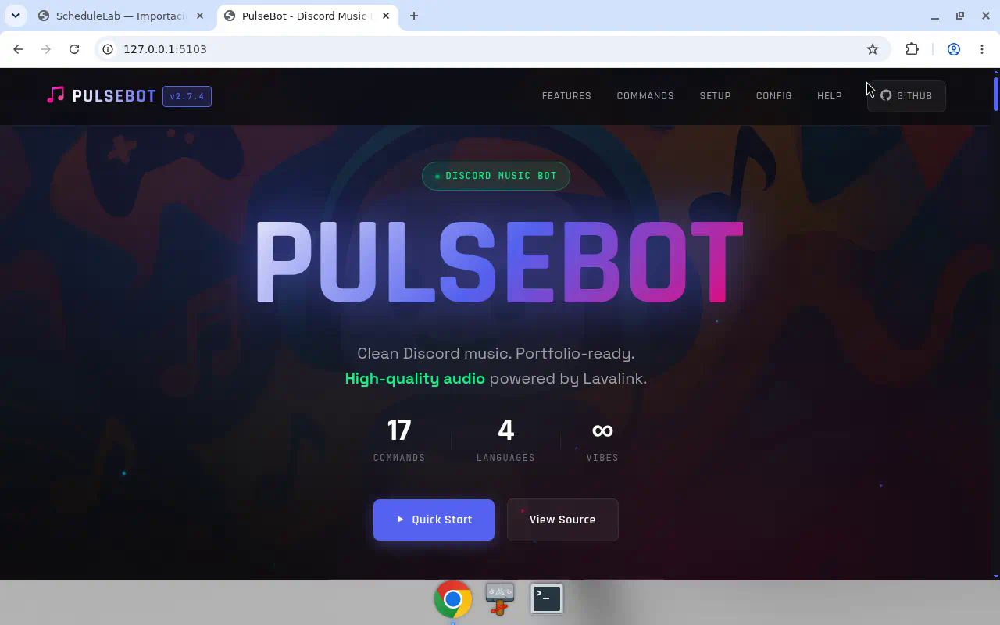

# PulseBot

Bot de música para Discord. Reproducción self-hosted con slash commands, cola, varios idiomas y Docker.

<!-- screenshots -->
## Vista




> Fork de [BeatDock](https://github.com/lazaroagomez/BeatDock) (Apache-2.0). Ver `LICENSE` y `NOTICE`.

**EN:** Discord music bot (BeatDock fork) with Lavalink, queue controls, i18n and Docker Compose.

## Qué hace

- Audio desde YouTube, SoundCloud, Bandcamp, Twitch y Vimeo (vía Lavalink)
- Spotify opcional (búsqueda/resolución)
- Cola, loop, shuffle, autoplay, filtros y letras
- Slash commands e idiomas: `en`, `es`, `tr`, `it`, `pt-BR`
- Docker Compose (bot + Lavalink) o nodos Lavalink públicos

## Stack

- Node.js 22+
- discord.js
- Lavalink 4 + lavalink-client
- Docker / Compose

## Arranque rápido (Docker)

1. Crea un bot en el [Developer Portal](https://discord.com/developers/applications) y activa los 3 Privileged Gateway Intents.
2. Clona y levanta:

```bash
git clone https://github.com/JoshuaDH1409/DJ-Yoshi.git
cd DJ-Yoshi
cp .env.example .env
# TOKEN=tu_token_de_discord
docker compose up -d --build
```

Contenedores: `pulsebot` (bot) y `pulsebot-lavalink` (audio).

```bash
docker compose logs -f
docker compose restart
docker compose down
```

Solo `TOKEN` es obligatorio. El resto (Spotify, idioma, volumen, roles, Lavalink) está en `.env.example`. No subas tokens reales.

Si no defines `LAVALINK_HOST` / `PORT` / `PASSWORD`, el bot puede usar nodos públicos v4. El `docker-compose.yml` incluye Lavalink local.

## Comandos

| Comando | Descripción |
|---------|-------------|
| `/play <query> [next]` | Reproducir (opcional al frente de la cola) |
| `/search <query>` | Buscar y elegir pista |
| `/pause` | Pausar / reanudar |
| `/skip` | Saltar |
| `/back` | Anterior |
| `/stop` | Parar y desconectar |
| `/queue` | Ver cola |
| `/shuffle` | Mezclar |
| `/autoplay` | Autoplay on/off |
| `/loop` | Loop on/off |
| `/clear` | Vaciar cola |
| `/volume <1-100>` | Volumen |
| `/lyrics` | Letras |
| `/filter` | Efectos / EQ |
| `/nowplaying` | Pista actual |
| `/invite` | Link de invitación |
| `/about` | Info del bot |

## Variables útiles

| Variable | Default | Notas |
|----------|---------|-------|
| `TOKEN` | — | Requerido |
| `SPOTIFY_ENABLED` | `false` | |
| `SPOTIFY_CLIENT_ID` / `SECRET` | — | Si Spotify está on |
| `DEFAULT_LANGUAGE` | `en` | `en`, `es`, `tr`, `it`, `pt-BR` |
| `DEFAULT_VOLUME` | `80` | |
| `AUTOPLAY_DEFAULT` | `false` | |
| `ALLOWED_ROLES` | — | IDs separados por coma |
| `DEFAULT_SEARCH_PLATFORM` | `ytmsearch` | |
| `LAVALINK_PASSWORD` | `youshallnotpass` | |
| `QUEUE_EMPTY_DESTROY_MS` | `30000` | |
| `EMPTY_CHANNEL_DESTROY_MS` | `60000` | |

Ajustes de Lavalink en `application.yml`.

## Estructura

```
src/           código del bot
locales/       i18n
docs/          docs estáticas
docker-compose.yml, Dockerfile, application.yml
NOTICE         atribución Apache-2.0 a BeatDock
```

## Credits

- Upstream: [BeatDock](https://github.com/lazaroagomez/BeatDock) de Lazaro Gomez
- Este repo: PulseBot / [JoshuaDH1409/DJ-Yoshi](https://github.com/JoshuaDH1409/DJ-Yoshi)
- Soporte opcional al autor original: [Ko-fi](https://ko-fi.com/lazaroagomez)
- Licencia: [Apache-2.0](LICENSE) — ver también `NOTICE` y `CHANGELOG.md`
